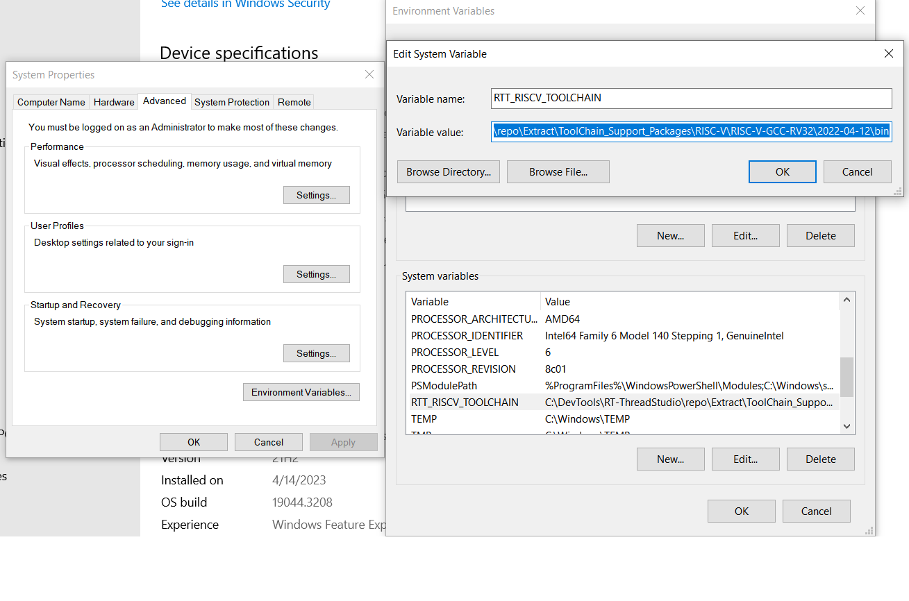

# rtt-bsp-hpm6750evkmini

HPM6750EVKMINI 开板的 RT-Thread Studio 板级支持包

## 支持的示例
***
- blink_led
- lv_demo_widgets
- rw007_wifi
- ethernet_demo
- sdcard_demo
- flashdb_demo
- pwmbeep_demo
- usb_device_generic_hid
- uart_dma_demo
- timer_demo
- can_example
- ethernet_ptp_master_demo
- ethernet_ptp_slave_demo
- usb_host_msc_udisk
- audio_pdm_audio_demo

## 环境设置

## 工具链环境设置
- 安装好BSP包后, 用户在创建示例/工程前需要 设置 `RTT_RISCV_TOOLCHAIN` 环境变量。
    - 假定RISC-V工具链安装于目录： `C:\DevTools\RT-ThreadStudio\repo\Extract\ToolChain_Support_Packages\RISC-V\RISC-V-GCC-RV32\2022-04-12\bin`, 用户可参考下图，配置`RTT_RISCV_TOOLCHAIN`环境变量 
    
