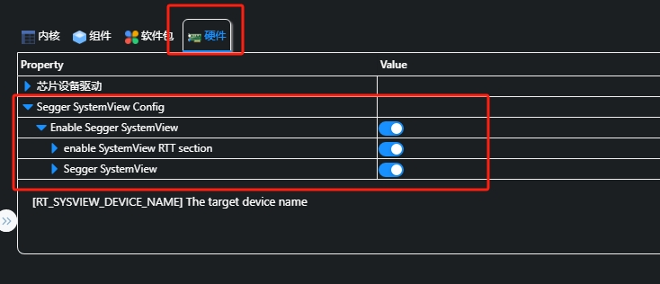
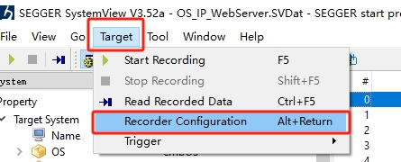
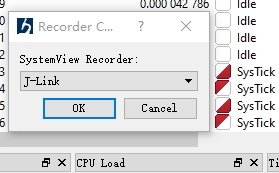
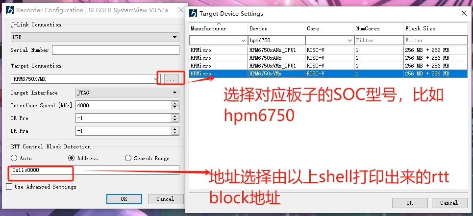
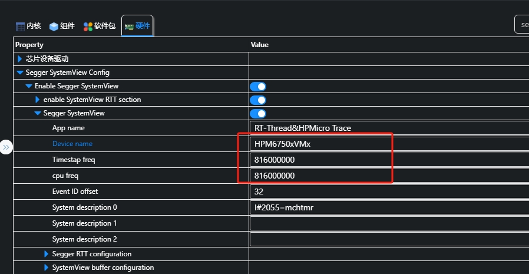
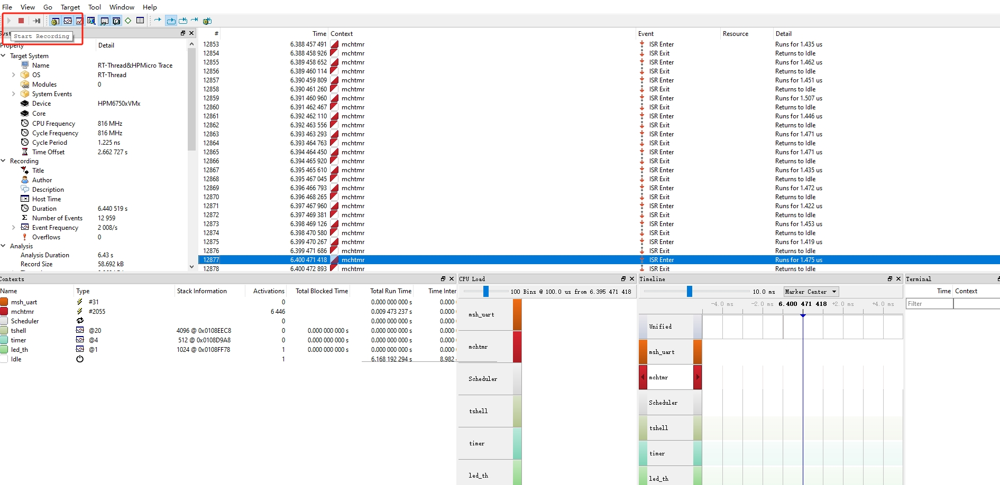
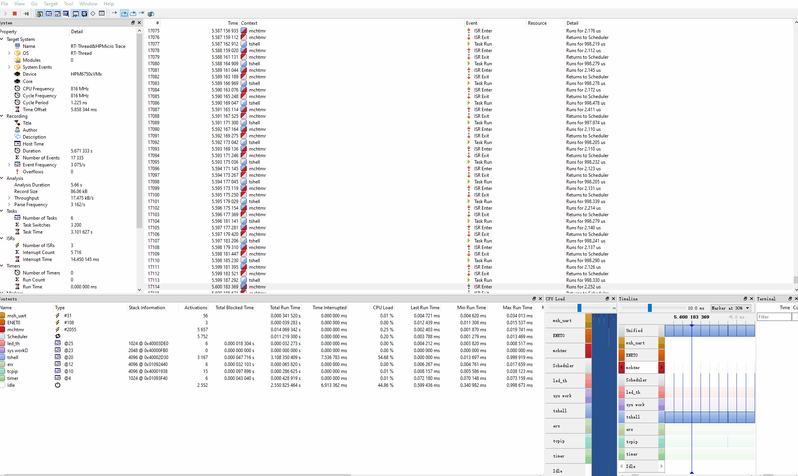

# 简介

本示例演示了SEGGER的调试工具SEGGER SystemView使用

## 硬件设置
* Segger SystemView 仅支持 Segger J-Link，并且需要支持riscv的jlink调试器，JLINK V10以上

## 如何使用该组件

* 在segger官网下载systemview软件，版本可最新。 https://www.segger.com/downloads/systemview

* 将工程中的libraries\misc\systemview\SystemView_Description\SYSVIEW_RTThread.txt' 复制到systemview安装目录下的Description文件夹

* 工程使能Segger SystemView



### 上电查看log信息
### 记住RTT Control Block Detection Address is 0x11c0000中的提示地址: 0x11c0000
### 记住cpu0 frequency:          816000000Hz的提示频率: 816000000
### 以上两个参数很重要，在配置systemview上位机时需要提供的地址和频率！！！！
```console
 \ | /
- RT -     Thread Operating System
 / | \     5.0.2 build Feb 29 2024 16:08:55
 2006 - 2022 Copyright by RT-Thread team
lwIP-2.1.2 initialized!
RTT Control Block Detection Address is 0x41c00dc0
cpu0 frequency:          816000000Hz

```

* 打开systemview软件，选择target中的recorder configuartion.



* 弹出的窗口选择默认：J-Link.


* target connection选择对应板子的soc型号，比如hpm6750evk2的soc为HPM6750xVMx,其他型号也可以在target Device Settings找到.RTT Control Block Detection中选择address，配置完毕后选择Ok.
### address选择上述log信息的地址，比如0x11c0000



### 同时工程的menuconfig setting也需要设置一样的SOC
### 频率查看上述提到的log打印出来的频率信息，比如816000000




* 点击 左上角提示的recording start按钮，即可开始录制记录



* 效果





## 注意

* 只能跟踪线程，调度程序和中断。
* 不支持跟踪 RT-Thread IPC 组件。
* systemview的RTT buffer大小默认为2048，若跟踪需求比较大，比如需要开启rtthread的object信息跟踪，需要根据需求增大该buffer大小