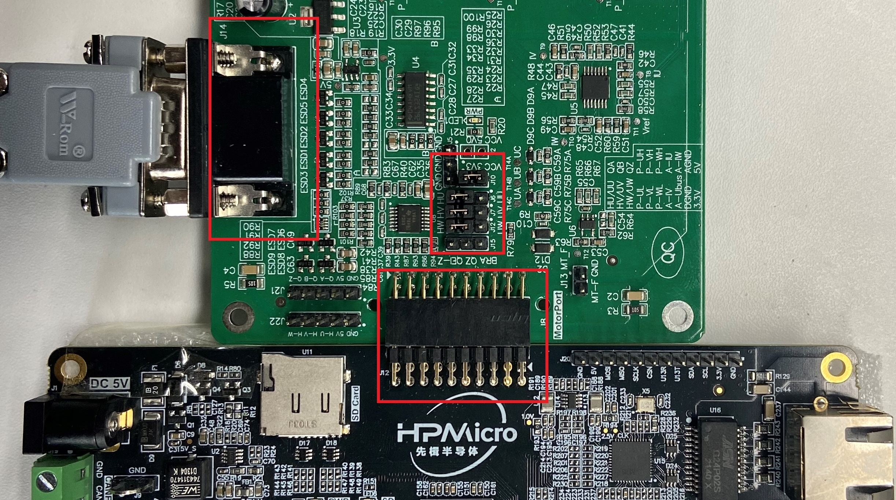

## 概述
***

**hall**工程主要演示霍尔传感器触发**hall**中断后，通过串口将霍尔定时器的时间数据打印出来。

- 霍尔中断
- 霍尔`U\V\W\TIMER`寄存器的数据读取

## 硬件设置
***
- 使用本例程前请首先安装串口终端之类的软件，确保你可以通过该软件正确观测串口数据

- 串口参数：

    - 波特率：115200
    - 数据位：8位
    - 校验位：无
    - 停止位：1
    - 流控位：无
    - 数据编码方式：ASCII

- 本例程电机使用的是雷赛智能的 **BLM57050-1000** 无刷电机，电机具体参数请参考雷赛智能官网
- **HPM6750EVK**核心板

    无需特别描述

- **DRV-LV50A-MP1907**电机驱动板

	- 使用跳线端子连接J12、J7、J6到HW、HV、HW
	- 使用跳线端子连接J10的VCC到3V3
	- 将电机的信号线插入J14插座
	- 将24V电源接入J3端子

	- **NOTE:**
		1. **插接电路板时不要带电操作**
		2. **单独给电机驱动板上电，观察电流是否异常。如果异常请检查线路连接**
		3. **进行下一步前，请确保已经给电机驱动板断电**

- 核心板和电机驱动板的连接

	- **HPM6750EVK**核心板和**DRV-LV50A-MP1907**电机驱动板

		- 核心板的J8和电机驱动板的J12相连。**注意对照丝印，不要插反**
		- 下图是连接完成后的整体效果图，红色方框标出了可能需要操作的器件的位置：

		

## 运行现象
***
- 上电后，打开串口终端，打印启动信息。每转动电机轴到一定角度，就会触发霍尔中断并依次打印如下信息，数据随着转动的快慢和方向变化，数据的具体含义请参考用户手册。

> u: 0xe0000000
> v: 0x87b6d17c
> w: 0x46999a8
> timer: 0xe149af9
