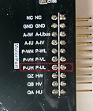
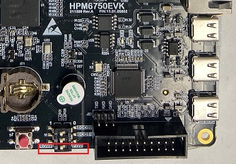

## 概述
***

**pwm**工程主要演示了如何配置几种不同类型的pwm波形并通过MCU的引脚进行输出。

- 强制输出
- 边沿对齐pwm
- 中心对齐pwm
- 中心对齐互补pwm
- 串口打印当前正在进行的测试的类型

## 硬件设置
***
- 使用本例程前请首先安装串口终端之类的软件，确保你可以通过该软件正确观测串口数据

- 为了更好的观测波形请准备一个双通道示波器

- 串口参数：

    - 波特率：115200
    - 数据位：8位
    - 校验位：无
    - 停止位：1
    - 流控位：无
    - 数据编码方式：ASCII

- 本例程电机使用的是雷赛智能的 **BLM57050-1000** 无刷电机，电机具体参数请参考雷赛智能官网
- **HPM6750EVK**核心板

    - J12端子的`P-UH 、P-U`L引脚为PWM输出引脚，如下图所示

        

    - **`P-UH` 后文统称为`P0`，`P-UL`后文统称为`P1`**

    - S1拨码开关第三位拨动到状态1

        

- **HPM6750EVKMINI**核心板

    - P1插件的`PWM0.P4`和`PWM0.P5`为PWM输出引脚，请参考原理图自行寻找
    - **`PWM0.P5` 后文统称为`P0`，`PWM0.P4`后文统称为`P1`**

## 运行现象
***
- 上电后，通过示波器可依次观测到P0、P1输出高电平、低电平、边沿对齐PWM、中心对齐PWM、中心对齐互补PWM
- 串口打印如下信息:

```
pwm example


>> Test force PWM output on P0 and P1
Output high
Output low


>> Generate edge aligned waveform
Two waveforms will be generated, PWM P0 is the target waveform
whose duty cycle will be updated from 0 - 100 and back to 0; PWM P1 is a reference


>> Generate central aligned waveform
Two waveforms will be generated, PWM P0 is the target waveform
whose duty cycle will be updated from 0 - 100 and back to 0; PWM P1 is a reference


>> Generate central aligned waveform in pair
Two waveforms will be generated in pair, PWM P0 and P1 are target
waveforms whose duty cycle will be updated from 0 - 100 and back to 0
test done

```
- 只依次输出一次PWM波形，如果需要再次观测波形，需要重新启动程序。
