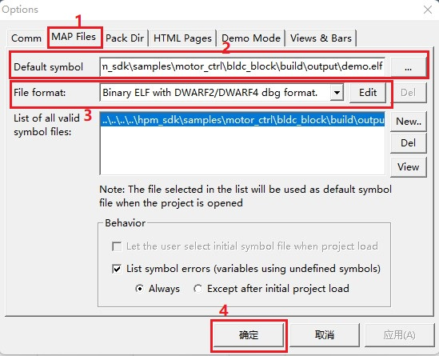
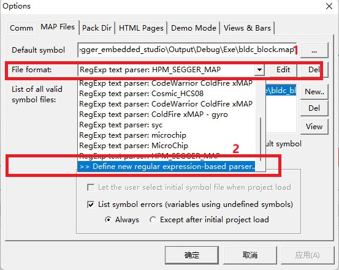
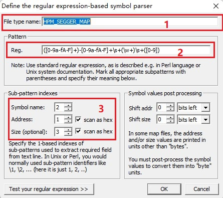

## 概述
***
**bldc_block**工程展示了直流无刷电机的转速控制。
- 通过**freemaster**进行转速调节
- 通过梯形波算法进行控制
- 支持**gnu、nds、segger**工具链

## 硬件设置
***
- 本例程电机使用的是雷赛智能的 **BLM57050-1000** 无刷电机，电机具体参数请参考雷赛智能官网。

- **HPM6750EVK**核心板

	- 拨动核心板的拨码开关S1的第三位到PWM模式

- **DRV-LV50A-MP1907**电机驱动板

	- 使用跳线端子连接J12、J7、J6到HW、HV、HW
	- 使用跳线端子连接J10的VCC到3V3
	- 将电机的U、V、W三相和J4端子按照正确的线序相连
	- 将电机的信号线插入J14插座
	- 将24V电源接入J3端子

	- **NOTE:**
		1. **请注意电源正负极方向**
		2. **插接电路板时不要带电操作**
		3. **单独给电机驱动板上电，观察电流是否异常。如果异常请检查线路连接**
		4. **进行下一步前，请确保已经给电机驱动板断电**

- 核心板和电机驱动板的连接

	- **HPM6750EVK**核心板和**DRV-LV50A-MP1907**电机驱动板

		- 核心板的J8和电机驱动板的J12相连。**注意对照丝印，不要插反**
		- 下图是连接完成后的整体效果图，红色方框标出了可能需要操作的器件的位置：

		

- **freemaster**的准备工作

	- 确保已经正确安装了**freemaster**，请自行通过网络获取相关软件及安装方法。
	- 确保你已经成功编译了工程，并已经生成elf格式文件
	- 在工程目录下找到[motor_block.pmpx](./motor_block.pmpx)的文件并双击打开
	- 在**freemaster**中加入编译生成的elf文件

		如果使用gnu-gcc或者nds-gcc编译，请使用如下方式配置：

		- Project->Options 可以出现下图，按照下图所示顺序和内容进行配置：

		

		如果使用segger环境，情况稍微复杂一点，请使用如下方式配置：

		**注意这里需要修改Default symbol载入的文件格式为map格式**
		- 打开配置File format的下拉列表并点击，如下图：

		

		- 然后按照如下内容进行配置，下文列出代码，方便拷贝

			```
			HPM_SEGGER_MAP
			([0-9a-fA-F]+)-[0-9a-fA-F]+\s+(\w+)\s+([0-9])
			```
			配置后应当如图所示：

			

	- **freemaster**选择正确的串口，确定核心板连接电脑后的串口号，Project->Options->Comm并按照下图进行配置

	

- 完成上述过程后，给驱动板上电观察电流无异常后，给核心板上电，再次确认电流无异常后，就可以烧录程序，观察运行现象。

## 运行现象
***
当工程正确运行后，电机以20r/s的速度运行。
点击**freemaster**的GO图标，启动freemaster即可配置如下数据：

``PID_I`` float类型

``PID_P`` float类型

``set_speed`` float类型， 输入范围+40~-40，单位r/s

也可以查看如下参数：

``speed`` float类型，单位r/s

## 注意事项
***
- 电机运行时，请时刻注意电流大小，如果发生异常，请随时准备切断电源
