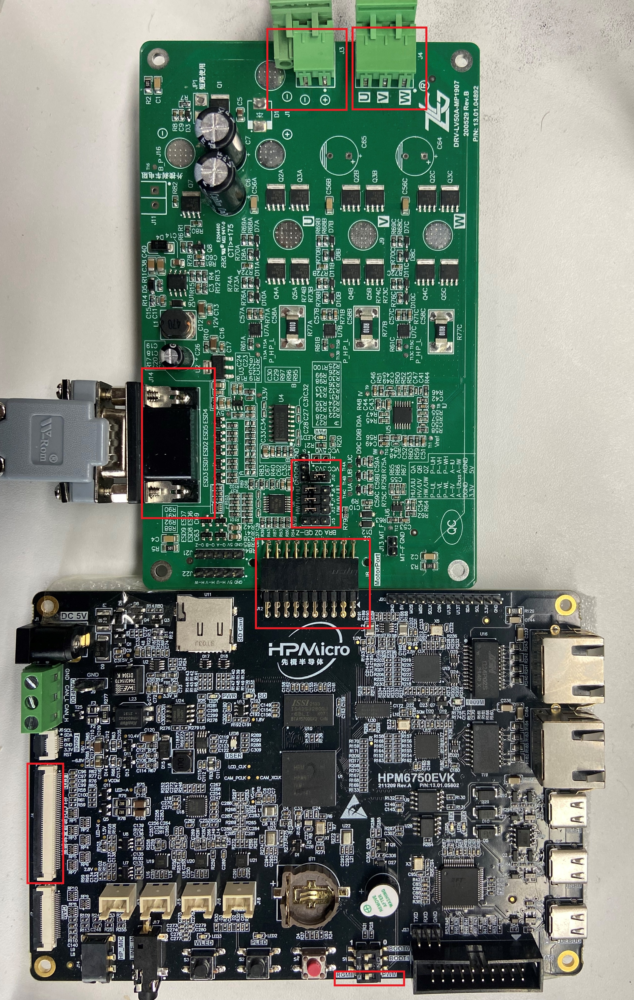

## 概述
***
**bldc_littlevgl_foc**工程展示了通过操作触摸屏对直流无刷电机进行控制。
- 电机控制算法为**FOC**
- 屏幕驱动库为**littlevgl**
- 通过触摸屏操作控制电机位置和速度
- 通过屏幕显示电机实时速度和位置
- 支持**gnu、nds、segger**工具链

## 硬件设置
***
- 本例程电机使用的是雷赛智能的 **BLM57050-1000** 无刷电机，电机具体参数请参考雷赛智能官网。

- **HPM6750EVK**核心板

	- 拨动核心板的拨码开关S1的第三位到PWM模式
	- 连接显示屏到LCD1接口，显示屏型号**LCD-800480W070TC**

- **DRV-LV50A-MP1907**电机驱动板

	- 使用跳线端子连接J12、J7、J6到HW、HV、HW
	- 使用跳线端子连接J10的VCC到3V3
	- 将电机的U、V、W三相和J4端子按照正确的线序相连
	- 将电机的信号线插入J14插座
	- 将24V电源接入J3端子

	- **NOTE:**
		1. **请注意电源正负极方向**
		2. **插接电路板时不要带电操作**
		3. **单独给电机驱动板上电，观察电流是否异常。如果异常请检查线路连接**
		4. **进行下一步前，请确保已经给电机驱动板断电**

- 核心板和电机驱动板的连接

	- **HPM6750EVK**核心板和**DRV-LV50A-MP1907**电机驱动板

		- 核心板的J8和电机驱动板的J12相连。**注意对照丝印，不要插反**
		- 下图是连接完成后的整体效果图，红色方框标出了可能需要操作的器件的位置：

		

- 完成上述过程后，给驱动板上电观察电流无异常后，给核心板上电，再次确认电流无异常后，就可以烧录程序，观察运行现象。

## 代码配置
***

- 如果需要更快的代码运行速度请在该工程的CMakeLists.txt中添加`sdk_compile_options("-mabi=ilp32f")`语句，获得较高的性能提升

## 运行现象
***

当工程正确运行后，有1~2S的时间进行初始化，并完成电机对中。之后屏幕会出现图形化界面，点击屏幕即可
进行速度以及位置的控制，同时屏幕会通过图形化界面显示速度和位置信息。

## 注意事项

- 电机上电后首先要完成对中动作，这时候请不要干预电机运行，否则会产生抖动

- 电机运行时，请时刻注意电流大小，如果发生异常，请随时准备切断电源。