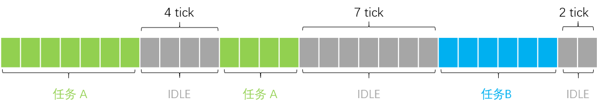

# CPU 使用率统计

统计单核 CPU 使用率。目前不支持多核


## 基本原理

每个时间片侦测一次当前线程，如果当前正在运行 idle 线程，空闲计数器自增。一个周期后，计算 IDEL 线程运行时间的占比。

例如：



上图展示一个周期内，某个 CPU 上线程时间片信息。假设一个方格代表一个时间片。

- 一个周期总时间片数 `30 tick`
- idle 总共运行 `13 tick`

CPU 使用率 = 13 / 30 * 100


## 使用方法

### 代码调用

```c
float load;
cpu_usage_init();
load = cpu_load_average();
printf("cpu load average: %f\n", load);
```

### 命令行

msh 命令行输入 `usage` 打印出 CPU 使用率

```sh
msh />usage
cpu: 31
```

msh 命令行输入 `usage -l 50`，调整 CPU 使用率，使其不低于 50%

```sh
msh />usage -l 50
CPU usage adjusted to 50%
msh />usage
cpu: 51
```

> 若系统没有使用自动初始化功能，在输出命令之前，主动调用 `cpu_usage_init` 进行初始化。


## API 介绍

`int cpu_usage_init(void)`

初始化 CPU 使用率统计功能。必须初始化之后才能获取正确的使用率

| 参数     | 描述       |
| -------- | ---------- |
| 无       |            |
| **返回** | **描述**   |
| 0        | 总是返回 0 |

`void cpu_usage_deinit(void)`

反初始化 CPU 使用率统计功能。当统计功能不需要时，调用此函数释放系统资源

| 参数     | 描述     |
| -------- | -------- |
| 无       |          |
| **返回** | **描述** |
| 无       | 无       |

`cpu_usage_t *cpu_usage_obj(void)`

获取统计对象，可以从统计对象中获得更详细的数据

| 参数        | 描述         |
| ----------- | ------------ |
| 无          |              |
| **返回**    | **描述**     |
| cpu_usage_t | CPU 统计对象 |

统计对象成员介绍

| 成员                | 描述                             |
| ------------------- | -------------------------------- |
| time                | 与系统心跳同频定时器             |
| state               | 运行状态                         |
| cpus                | CPU 数量                         |
| suspend_tick        | 上次挂起时的 tick 值             |
| period              | 统计周期                         |
| idle_stat.idle_tick | idle 运行总时长（tick）          |
| idle_stat.last_tick | 上个周期开始时间戳（tick）       |
| idle_stat.load      | 上个周期其他线程执行时长（tick） |
| idle_stat.tid       | idle 线程对象                    |

统计状态介绍

| 状态                        | 描述               |
| --------------------------- | ------------------ |
| CPU_USAGE_STATE_DEACTIVATED | 未初始化，停止状态 |
| CPU_USAGE_STATE_ACTIVATED   | 正在运行           |
| CPU_USAGE_STATE_SUSPEND     | 被挂起，等待恢复   |

`void cpu_usage_suspend(void)`

挂起 CPU 使用率统计功能。系统低功耗期间使用。

| 参数     | 描述     |
| -------- | -------- |
| 无       |          |
| **返回** | **描述** |
| 无       | 无       |

`void cpu_usage_resume(void)`

恢复 CPU 使用率统计功能。低功耗恢复时使用。

| 参数     | 描述     |
| -------- | -------- |
| 无       |          |
| **返回** | **描述** |
| 无       | 无       |

`float cpu_load_average(void)`

获取 CPU 平均使用率

| 参数     | 描述           |
| -------- | -------------- |
| 无       |                |
| **返回** | **描述**       |
| float    | CPU 平均使用率 |