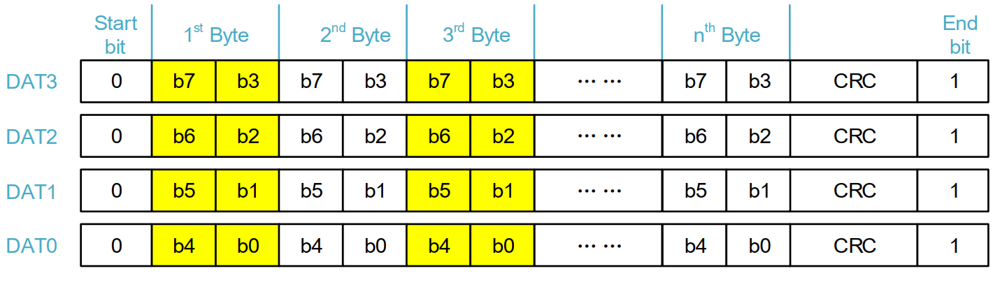

## 简介

在调试SDIO接口的WiFi驱动时，WiFi驱动使用到了`数据流传输`模式，在`Cortex-M4`内核的芯片中，多数`sdio`外设是没有完全按照规范文件来的，在数据流传输完成后外设不会发送数据的`CRC16校验`，如下图的`GD32F4xx`用户手册中可以看到，在使用`数据流传输`模式确实是不支持触发硬件CRC的传输。而在较新的`Cortex-M7`内核的芯片中，`sdio`外设是严格按照规范来的，例如`STM32H750`。


## 数据传输格式

为了让`Cortex-M4`也支持数据流传输，我们可以使用软件计算好`CRC16`值并通过总线发送出去。<br>
首先我们需要搞清楚`SDIO`是如何将数据通过总线送出的。在`GD32F4xx`的`用户手册中`是有详细说明的。

**1位数据总线宽度**


**4位数据总线宽度**



**8位数据总线宽度**


通过上图可以看出数据的传输方式我们通过软件计算`CRC16`校验值。在1位数据总线的情况下好计算，只有一个`CRC16`校验值。<br>
但是如果是4位或者8位总下你宽度的情况下，就需要`按位`计算`每根数据线`上的`CRC16值`，并`只在每根数据线上`发出`对应数据线上的CRC16校验值`。<br>


无论在窄总线模式还是宽总线模式，`CRC16`都是针对`本条信号线`计算的。例如对于宽总线模式，在传输一个512B的块时，每条线上需要传输 512*8/4 = 1024 bits ，CRC16 仅仅针对这 1024bits 进行计算，并在数据传输完成后在`本条线上传输这个 CRC16 (16bits)`

## 解决方案

因为我这边只有4位总线宽度的设备可以调试，所以只做了1位和4位总线数据宽度的CRC16校验值计算。8位宽度也一样的意思，拆分方法不同而已。

按照如下步骤进行软件CRC16校验值的计算
- 首先需要将4位总线宽度数据拆分为每根数据线上的数据
- 按位计算每根数据线上的CRC16值
- 将每个数据线的CRC值合并成总线数据
- 将合并成总线数据的CRC16值发出

以下是SDIO的CRC16计算程序：

drv_sdio_crc.c
```c
/*
 * Copyright (c) 2006-2024, RT-Thread Development Team
 *
 * SPDX-License-Identifier: Apache-2.0
 *
 * Change Logs:
 * Date             Author          Notes
 * 2024-02-02       Evlers          first version
 */

#include "stdint.h"
#include "drv_sdio_crc.h"

/**
 * @brief Calculate CRC7 bit by bit
 *
 * @param crc The last or initialized crc value
 * @param byte Bit data
 * @param bits The number of bit to be calculated (max is 8)
 * @return uint16_t Output CRC7 value
 */
static uint8_t calc_crc7 (uint8_t crc, uint8_t byte, uint8_t bits)
{
    for (int i = bits - 1; i >= 0; i --)
    {
        uint8_t bit = (byte >> i) & 0x0001;
        uint8_t crchigh = (crc >> 6) & 0x0001;
        uint8_t xorb  = crchigh ^ bit;
        crc <<= 1;
        crc  &= 0x7F;
        crc  ^= (xorb << 3) | xorb;
    }

    return crc;
}

/**
 * @brief Calculate CRC16 bit by bit
 *
 * @param crc The last or initialized crc value
 * @param byte Bit data
 * @param bits The number of bit to be calculated (max is 8)
 * @return uint16_t Output CRC16 value
 */
static uint16_t calc_crc16 (uint16_t crc, uint8_t byte, uint8_t bits)
{
    for (int i = bits - 1; i >= 0; i --)
    {
        uint16_t bit = (byte >> i) & 0x0001;
        uint16_t crchigh = (crc >> 15) & 0x0001;
        uint16_t xorb  = crchigh ^ bit;
        crc <<= 1;
        crc  &= 0xFFFF;
        crc  ^= (xorb << 12) | (xorb << 5) | xorb;
    }

    return crc;
}

/**
 * @brief Compute CRC7 bit by bit for the data buffer
 *
 * @param ptr Bit data buffer
 * @param bit_num Number of bits
 * @return uint16_t Output CRC7 value
 */
uint8_t sdio_crc7_calc (const uint8_t *ptr, uint32_t bit_num)
{
    uint32_t index = 0;
    uint8_t crc = 0;

    while (index < bit_num)
    {
        uint8_t calc_bit_num = (bit_num - index) >= 8 ? 8 : bit_num - index;
        crc = calc_crc7(crc, ptr[index / 8], calc_bit_num);
        index += calc_bit_num;
    }

    return crc;
}

/**
 * @brief Compute CRC16 bit by bit for the data buffer
 *
 * @param ptr Bit data buffer
 * @param bit_num Number of bits
 * @return uint16_t Output CRC16 value
 */
static uint16_t sdio_crc16_calc (const uint8_t *ptr, uint32_t bit_num)
{
    uint32_t index = 0;
    uint16_t crc = 0;

    while (index < bit_num)
    {
        uint8_t calc_bit_num = (bit_num - index) >= 8 ? 8 : bit_num - index;
        crc = calc_crc16(crc, ptr[index / 8], calc_bit_num);
        index += calc_bit_num;
    }

    return crc;
}


/**
 * The SDIO data CRC16 value needs to be calculated separately for each data wire
 * Calculated CRC16 on a bitwise basis for each data wire.
 * After calculating the CRC value on each data line, it needs to be combined into bus data and sent out.
 * Because the CRC16 value is only transmitted on each data line.
 */

/**
 * @brief Split the bus data onto each data wire
 *
 * @param each_data_wire Output the data of each data wire
 * @param bus_data Input bus data
 * @param len Bus data length
 */
static void split_4bit_bus_data (uint8_t *each_data_wire[4], uint8_t *bus_data, uint32_t len)
{
    for (uint32_t i = 0; i < len; i ++)
    {
        uint8_t temp = i >= len ? 0 : bus_data[i];
        uint8_t j = i / 4;

        each_data_wire[3][j] <<= 1;
        each_data_wire[2][j] <<= 1;
        each_data_wire[1][j] <<= 1;
        each_data_wire[0][j] <<= 1;

        if (temp & 0x80) each_data_wire[3][j] |= 0x01;
        else each_data_wire[3][j] &= ~0x01;

        if (temp & 0x40) each_data_wire[2][j] |= 0x01;
        else each_data_wire[2][j] &= ~0x01;

        if (temp & 0x20) each_data_wire[1][j] |= 0x01;
        else each_data_wire[1][j] &= ~0x01;

        if (temp & 0x10) each_data_wire[0][j] |= 0x01;
        else each_data_wire[0][j] &= ~0x01;

        each_data_wire[3][j] <<= 1;
        each_data_wire[2][j] <<= 1;
        each_data_wire[1][j] <<= 1;
        each_data_wire[0][j] <<= 1;

        if (temp & 0x08) each_data_wire[3][j] |= 0x01;
        else each_data_wire[3][j] &= ~0x01;

        if (temp & 0x04) each_data_wire[2][j] |= 0x01;
        else each_data_wire[2][j] &= ~0x01;

        if (temp & 0x02) each_data_wire[1][j] |= 0x01;
        else each_data_wire[1][j] &= ~0x01;

        if (temp & 0x01) each_data_wire[0][j] |= 0x01;
        else each_data_wire[0][j] &= ~0x01;
    }
}

/**
 * @brief Calculates the CRC16 value of the each data wire
 *
 * @param crc_value Output the CRC16 value of each data wire
 * @param each_data_wire Input the data of each data wire
 * @param bit_num The number of bits per data wire
 */
static void calc_each_data_wire_crc16 (uint8_t crc_value[8], uint8_t *each_data_wire[4], uint32_t bit_num)
{
    uint16_t crc16;

    /* Calculate the CRC16/CCITT of the each data wire */
    crc16 = sdio_crc16_calc(each_data_wire[0], bit_num);
    crc_value[0] = (uint8_t )(crc16 >> 8);
    crc_value[1] = (uint8_t )crc16;

    crc16 = sdio_crc16_calc(each_data_wire[1], bit_num);
    crc_value[2] = (uint8_t )(crc16 >> 8);
    crc_value[3] = (uint8_t )crc16;

    crc16 = sdio_crc16_calc(each_data_wire[2], bit_num);
    crc_value[4] = (uint8_t )(crc16 >> 8);
    crc_value[5] = (uint8_t )crc16;

    crc16 = sdio_crc16_calc(each_data_wire[3], bit_num);
    crc_value[6] = (uint8_t )(crc16 >> 8);
    crc_value[7] = (uint8_t )crc16;
}

/**
 * @brief Merge CRC values for each data wire into the bus
 *
 * @param output Merge to the bus for crc data
 * @param input CRC16 data for each data wire
 */
static void merge_crc_to_bus (uint8_t output[8], uint8_t input[8])
{
    uint8_t movebit1 = 0x80, movebit2 = 0x40;

    for (uint8_t i = 0; i < 8; i ++)
    {
        uint8_t k = i / 4;

        if (i == 4)
        {
            movebit1 = 0x80;
            movebit2 = 0x40;
        }

        for (uint8_t j = 0; j < 8; j += 2)
        {
            uint8_t temp = input[j + k];
            output[i] >>= 1;

            if (temp & movebit1) output[i] |= 0x80;
            else output[i] &= ~0x80;

            if(temp & movebit2) output[i] |= 0x08;
            else output[i] &= ~0x08;
        }

        movebit1 >>= 2;
        movebit2 >>= 2;
    }
}

/**
 * @brief Calculate CRC16 for SDIO bus data
 *
 * @param crc Output CRC16 value[2]
 * @param ptr SDIO data (1wire)
 * @param len Length for sdio bus data
 */
void sdio_crc16_calc_1bit_bus (uint8_t crc[2], uint8_t *ptr, uint16_t len)
{
    uint16_t crc16 = sdio_crc16_calc(ptr, len * 8);

    crc[0] = (uint8_t )(crc16 >> 8);
    crc[1] = (uint8_t )crc16;
}

/**
 * @brief Calculate CRC16 for SDIO bus data
 *
 * @param crc Output CRC16 value[8]
 * @param ptr SDIO bus data (4wire)
 * @param len Length for sdio data
 */
void sdio_crc16_calc_4bit_bus (uint8_t crc[8], uint8_t *ptr, uint16_t len)
{
    uint8_t data_wire[4][DRV_SDIO_CRC16_4BIT_BUS_DATA_MAX_LEN / 8 / 4] = { 0 };
    uint8_t *each_data_wire[4] = { data_wire[0], data_wire[1], data_wire[2], data_wire[3] };
    uint8_t crc_buff[8] = { 0 };

    /* The bus data length must not exceed the allowed range */
    if (len > DRV_SDIO_CRC16_4BIT_BUS_DATA_MAX_LEN) return ;

    /* Split the bus data onto each data wire */
    split_4bit_bus_data(each_data_wire, ptr, len);

    /* Calculates the CRC16 value of the each data wire */
    calc_each_data_wire_crc16(crc_buff, each_data_wire, len * 8 / 4);

    /* Merge CRC values for each data wire into the bus */
    merge_crc_to_bus(crc, crc_buff);
}

```

drv_sdio_crc.h
```c
/*
 * Copyright (c) 2006-2024, RT-Thread Development Team
 *
 * SPDX-License-Identifier: Apache-2.0
 *
 * Change Logs:
 * Date             Author          Notes
 * 2024-02-02       Evlers          first version
 */

#ifndef _DRV_SDIO_CRC_H_
#define _DRV_SDIO_CRC_H_

/* The maximum bus data length calculated by CRC16 */
#define DRV_SDIO_CRC16_4BIT_BUS_DATA_MAX_LEN        512
#define DRV_SDIO_CRC16_8BIT_BUS_DATA_MAX_LEN        512

uint8_t sdio_crc7_calc (const uint8_t *ptr, uint32_t bit_num);

void sdio_crc16_calc_1bit_bus (uint8_t crc[2], uint8_t *ptr, uint16_t len);
void sdio_crc16_calc_4bit_bus (uint8_t crc[8], uint8_t *ptr, uint16_t len);

#endif /* _DRV_SDIO_CRC_H_ */

```


根据上面的方法，在drv_sdio.c文件中进行调用计算CRC结果并发出。
以下是基于`GD32F4xx`适用于`RT-Thread`的`SDIO`驱动程序：

drv_sdio.c
```c
/*
 * Copyright (c) 2006-2024, RT-Thread Development Team
 *
 * SPDX-License-Identifier: Apache-2.0
 *
 * Change Logs:
 * Date             Author          Notes
 * 2023-12-30       Evlers          first version
 * 2024-01-21       Evlers          Add support for byte stream data transfer software CRC16
 * 2024-03-20       Evlers          add driver configure
 * 2024-03-21       Evlers          add msp layer supports
 * 2024-06-28       Evlers          fix wild pointer in clk_get
 */

#include <rthw.h>
#include <rtthread.h>
#include <rtdevice.h>

#ifdef BSP_USING_SDIO

#include <string.h>
#include "drv_sdio.h"
#include "drv_sdio_crc.h"
#include "drv_dma.h"
#include "drv_config.h"

/**
 * When the WiFi module is hibernating,
 * command 52 will time out for the first time.
 * This is a normal phenomenon and can be ignored.
 * So here the log level is set to the lowest (no logs are printed).
 */
#define DBG_TAG             "drv.sdio"
#define DBG_LVL             -1
#define DBG_COLOR
#include <rtdbg.h>

#define SDIO_TX_RX_COMPLETE_TIMEOUT_LOOPS       (1000000)

#define RTHW_SDIO_LOCK(_sdio)                   rt_mutex_take(&_sdio->mutex, RT_WAITING_FOREVER)
#define RTHW_SDIO_UNLOCK(_sdio)                 rt_mutex_release(&_sdio->mutex);

static const struct gd32_sdio_config sdio_config = SDIO_CONFIG;
static const struct dma_config dma_config = SDIO_DMA_CONFIG;

struct sdio_pkg
{
    struct rt_mmcsd_cmd *cmd;
    void *buff;
    rt_uint32_t flag;
};

struct rthw_sdio
{
    struct rt_mmcsd_host *host;
    struct gd32_sdio_des sdio_des;
    struct rt_event event;
    struct rt_mutex mutex;
    struct sdio_pkg *pkg;
};

rt_align(SDIO_ALIGN)
static rt_uint8_t cache_buf[SDIO_BUFF_SIZE];

static rt_uint32_t gd32_sdio_clk_get(uint32_t hw_sdio)
{
    return sdio_config.sdio_clock_freq;
}

/*!
    \brief      get the data block size
    \param[in]  bytesnumber: the number of bytes
    \param[out] none
    \retval     data block size
      \arg        SDIO_DATABLOCKSIZE_1BYTE: block size = 1 byte
      \arg        SDIO_DATABLOCKSIZE_2BYTES: block size = 2 bytes
      \arg        SDIO_DATABLOCKSIZE_4BYTES: block size = 4 bytes
      \arg        SDIO_DATABLOCKSIZE_8BYTES: block size = 8 bytes
      \arg        SDIO_DATABLOCKSIZE_16BYTES: block size = 16 bytes
      \arg        SDIO_DATABLOCKSIZE_32BYTES: block size = 32 bytes
      \arg        SDIO_DATABLOCKSIZE_64BYTES: block size = 64 bytes
      \arg        SDIO_DATABLOCKSIZE_128BYTES: block size = 128 bytes
      \arg        SDIO_DATABLOCKSIZE_256BYTES: block size = 256 bytes
      \arg        SDIO_DATABLOCKSIZE_512BYTES: block size = 512 bytes
      \arg        SDIO_DATABLOCKSIZE_1024BYTES: block size = 1024 bytes
      \arg        SDIO_DATABLOCKSIZE_2048BYTES: block size = 2048 bytes
      \arg        SDIO_DATABLOCKSIZE_4096BYTES: block size = 4096 bytes
      \arg        SDIO_DATABLOCKSIZE_8192BYTES: block size = 8192 bytes
      \arg        SDIO_DATABLOCKSIZE_16384BYTES: block size = 16384 bytes
*/
static uint32_t sd_datablocksize_get(uint16_t bytesnumber)
{
    uint8_t exp_val = 0;
    /* calculate the exponent of 2 */
    while(1 != bytesnumber){
        bytesnumber >>= 1;
        ++exp_val;
    }
    return DATACTL_BLKSZ(exp_val);
}

static void rthw_sdio_wait_completed(struct rthw_sdio *sdio)
{
    rt_uint32_t status;
    struct rt_mmcsd_cmd *cmd = sdio->pkg->cmd;
    struct rt_mmcsd_data *data = cmd->data;
    int err_level = DBG_ERROR;

    if (rt_event_recv(&sdio->event, 0xffffffff, RT_EVENT_FLAG_OR | RT_EVENT_FLAG_CLEAR,
                      rt_tick_from_millisecond(5000), &status) != RT_EOK)
    {
        LOG_E("wait completed timeout!!");
        cmd->err = -RT_ETIMEOUT;
        return;
    }

    if (sdio->pkg == RT_NULL)
    {
        return;
    }

    cmd->resp[0] = sdio_response_get(SDIO_RESPONSE0);
    if (resp_type(cmd) == RESP_R2)
    {
        cmd->resp[1] = sdio_response_get(SDIO_RESPONSE1);
        cmd->resp[2] = sdio_response_get(SDIO_RESPONSE2);
        cmd->resp[3] = sdio_response_get(SDIO_RESPONSE3);
    }

    if (status & HW_SDIO_ERRORS)
    {
        if ((status & SDIO_STAT_CCRCERR) && (resp_type(cmd) & (RESP_R3 | RESP_R4)))
        {
            cmd->err = RT_EOK;
        }
        else
        {
            cmd->err = -RT_ERROR;
        }

        if (status & SDIO_STAT_CMDTMOUT)
        {
            cmd->err = -RT_ETIMEOUT;
        }

        if (status & SDIO_STAT_DTCRCERR)
        {
            data->err = -RT_ERROR;
        }

        if (status & SDIO_STAT_DTTMOUT)
        {
            data->err = -RT_ETIMEOUT;
        }

        if (cmd->err == RT_EOK)
        {
            goto __print_status;
        }
        else
        {
            if ((cmd->cmd_code == 5) || (cmd->cmd_code == 8))
            {
                err_level = DBG_WARNING;
            }
            dbg_log(err_level, "error: 0x%08x, %s%s%s%s%s%s%s cmd: %d arg: 0x%08x data_dir: %c len: %d blksize: %d\n",
                    status,
                    status & SDIO_STAT_CCRCERR  ? "CCRCFAIL "   : "",
                    status & SDIO_STAT_DTCRCERR ? "DCRCFAIL "   : "",
                    status & SDIO_STAT_CMDTMOUT ? "CTIMEOUT "   : "",
                    status & SDIO_STAT_DTTMOUT  ? "DTIMEOUT "   : "",
                    status & SDIO_STAT_TXURE    ? "TXUNDERR "   : "",
                    status & SDIO_STAT_RXORE    ? "RXOVERR "    : "",
                    status == 0                 ? "NULL"        : "",
                    cmd->cmd_code,
                    cmd->arg,
                    data ? (data->flags & DATA_DIR_WRITE ?  'w' : 'r') : '-',
                    data ? data->blks * data->blksize : 0,
                    data ? data->blksize : 0
                   );
        }
    }
    else
    {
        cmd->err = RT_EOK;
        __print_status:
        LOG_D("status: 0x%08X [%08X %08X %08X %08X]", status, cmd->resp[0], cmd->resp[1], cmd->resp[2], cmd->resp[3]);
    }
}

static void rthw_sdio_transfer_by_dma(struct rthw_sdio *sdio, struct sdio_pkg *pkg)
{
    int size;
    dma_multi_data_parameter_struct dma_struct;

    RT_ASSERT(sdio != RT_NULL);
    RT_ASSERT(pkg != RT_NULL);
    RT_ASSERT(pkg->cmd->data != RT_NULL);
    RT_ASSERT(pkg->buff != RT_NULL);

    size = pkg->cmd->data->blks * pkg->cmd->data->blksize;

    /* clear all the interrupt flags */
    dma_flag_clear(dma_config.periph, dma_config.channel, DMA_FLAG_FEE);
    dma_flag_clear(dma_config.periph, dma_config.channel, DMA_FLAG_SDE);
    dma_flag_clear(dma_config.periph, dma_config.channel, DMA_FLAG_TAE);
    dma_flag_clear(dma_config.periph, dma_config.channel, DMA_FLAG_HTF);
    dma_flag_clear(dma_config.periph, dma_config.channel, DMA_FLAG_FTF);
    dma_channel_disable(dma_config.periph, dma_config.channel);
    dma_deinit(dma_config.periph, dma_config.channel);

    sdio_dma_enable();
    if (pkg->cmd->data->flags & DATA_DIR_WRITE)
    {
        /* configure the DMA channel */
        dma_struct.periph_addr        = (uint32_t)&SDIO_FIFO;
        dma_struct.memory0_addr       = (uint32_t)pkg->buff;
        dma_struct.direction          = DMA_MEMORY_TO_PERIPH;
        dma_struct.number             = size;
        dma_struct.periph_inc         = DMA_PERIPH_INCREASE_DISABLE;
        dma_struct.memory_inc         = DMA_MEMORY_INCREASE_ENABLE;
        dma_struct.circular_mode      = DMA_CIRCULAR_MODE_DISABLE;

        if (pkg->cmd->data->flags & DATA_STREAM)
        {
            dma_struct.periph_width       = DMA_PERIPH_WIDTH_32BIT;
            dma_struct.memory_width       = DMA_MEMORY_WIDTH_8BIT;
            dma_struct.priority           = DMA_PRIORITY_ULTRA_HIGH;
            dma_struct.periph_burst_width = DMA_PERIPH_BURST_4_BEAT;
            dma_struct.memory_burst_width = DMA_MEMORY_BURST_SINGLE;
            dma_struct.critical_value     = DMA_FIFO_4_WORD;
        }
        else
        {
            dma_struct.periph_width       = DMA_PERIPH_WIDTH_32BIT;
            dma_struct.memory_width       = DMA_MEMORY_WIDTH_32BIT;
            dma_struct.priority           = DMA_PRIORITY_ULTRA_HIGH;
            dma_struct.periph_burst_width = DMA_PERIPH_BURST_4_BEAT;
            dma_struct.memory_burst_width = DMA_MEMORY_BURST_4_BEAT;
            dma_struct.critical_value     = DMA_FIFO_4_WORD;
        }
        dma_multi_data_mode_init(dma_config.periph, dma_config.channel, &dma_struct);

        dma_flow_controller_config(dma_config.periph, dma_config.channel, DMA_FLOW_CONTROLLER_PERI);
        dma_channel_subperipheral_select(dma_config.periph, dma_config.channel, dma_config.subperiph);
        dma_channel_enable(dma_config.periph, dma_config.channel);
    }
    else if (pkg->cmd->data->flags & DATA_DIR_READ)
    {
        /* configure the DMA channel */
        dma_struct.periph_addr        = (uint32_t)&SDIO_FIFO;
        dma_struct.memory0_addr       = (uint32_t)pkg->buff;
        dma_struct.direction          = DMA_PERIPH_TO_MEMORY;
        dma_struct.number             = size;
        dma_struct.periph_inc         = DMA_PERIPH_INCREASE_DISABLE;
        dma_struct.memory_inc         = DMA_MEMORY_INCREASE_ENABLE;
        dma_struct.circular_mode      = DMA_CIRCULAR_MODE_DISABLE;

        if (pkg->cmd->data->flags & DATA_STREAM)
        {
            dma_struct.periph_width       = DMA_PERIPH_WIDTH_32BIT;
            dma_struct.memory_width       = DMA_MEMORY_WIDTH_8BIT;
            dma_struct.priority           = DMA_PRIORITY_ULTRA_HIGH;
            dma_struct.periph_burst_width = DMA_PERIPH_BURST_SINGLE;
            dma_struct.memory_burst_width = DMA_MEMORY_BURST_SINGLE;
            dma_struct.critical_value     = DMA_FIFO_4_WORD;
        }
        else
        {
            dma_struct.periph_width       = DMA_PERIPH_WIDTH_32BIT;
            dma_struct.memory_width       = DMA_MEMORY_WIDTH_32BIT;
            dma_struct.priority           = DMA_PRIORITY_ULTRA_HIGH;
            dma_struct.periph_burst_width = DMA_PERIPH_BURST_4_BEAT;
            dma_struct.memory_burst_width = DMA_MEMORY_BURST_4_BEAT;
            dma_struct.critical_value     = DMA_FIFO_4_WORD;
        }
        dma_multi_data_mode_init(dma_config.periph, dma_config.channel, &dma_struct);

        dma_flow_controller_config(dma_config.periph, dma_config.channel, DMA_FLOW_CONTROLLER_PERI);
        dma_channel_subperipheral_select(dma_config.periph, dma_config.channel, dma_config.subperiph);
        dma_channel_enable(dma_config.periph, dma_config.channel);

        /* enable the DSM(data state machine) for data transfer */
        sdio_dsm_enable();
    }
}

static void rthw_sdio_send_command(struct rthw_sdio *sdio, struct sdio_pkg *pkg)
{
    struct rt_mmcsd_cmd *cmd = pkg->cmd;
    struct rt_mmcsd_data *data = cmd->data;

    rt_event_control(&sdio->event, RT_IPC_CMD_RESET, RT_NULL);

    /* save pkg */
    sdio->pkg = pkg;

    LOG_D("cmd: %d arg: 0x%08x response_type: %s%s%s%s%s%s%s%s%s data_dir: %c len: %d blksize: %d",
            cmd->cmd_code,
            cmd->arg,
            resp_type(cmd) == RESP_NONE ? "NONE": "",
            resp_type(cmd) == RESP_R1   ? "R1"  : "",
            resp_type(cmd) == RESP_R1B  ? "R1B" : "",
            resp_type(cmd) == RESP_R2   ? "R2"  : "",
            resp_type(cmd) == RESP_R3   ? "R3"  : "",
            resp_type(cmd) == RESP_R4   ? "R4"  : "",
            resp_type(cmd) == RESP_R5   ? "R5"  : "",
            resp_type(cmd) == RESP_R6   ? "R6"  : "",
            resp_type(cmd) == RESP_R7   ? "R7"  : "",
            data ? (data->flags & DATA_DIR_WRITE ?  'w' : 'r') : '-',
            data ? data->blks * data->blksize : 0,
            data ? data->blksize : 0
           );

    /* config data transfer */
    if (data != RT_NULL)
    {
        /* clear all DSM configuration */
        sdio_data_config(0, 0, SDIO_DATABLOCKSIZE_1BYTE);
        sdio_data_transfer_config(SDIO_TRANSMODE_BLOCK, SDIO_TRANSDIRECTION_TOCARD);
        sdio_dsm_disable();
        sdio_dma_disable();

        /* Hardware CRC16 computation is not supported in the case of byte stream transmission */
        if ((data->flags & DATA_STREAM) && (data->flags & DATA_DIR_WRITE))
        {
            /* The CRC16 value is calculated by software and sent out from the bus */
            if ((sdio->host->flags & MMCSD_BUSWIDTH_4) && (data->blksize < DRV_SDIO_CRC16_4BIT_BUS_DATA_MAX_LEN))
            {
                sdio_crc16_calc_4bit_bus((uint8_t *)pkg->buff + data->blksize, (uint8_t *)pkg->buff, data->blksize);
                data->blksize += 8;
            }
            else if ((sdio->host->flags & MMCSD_BUSWIDTH_8) && (data->blksize < DRV_SDIO_CRC16_8BIT_BUS_DATA_MAX_LEN))
            {
                /* Software CRC calculations with 4-bit and 1-bit bus widths are supported only */
                RT_ASSERT(!(sdio->host->flags & MMCSD_BUSWIDTH_8));
            }
            else if (!(sdio->host->flags & (MMCSD_BUSWIDTH_4 | MMCSD_BUSWIDTH_8)))
            {
                sdio_crc16_calc_1bit_bus((uint8_t *)pkg->buff + data->blksize, (uint8_t *)pkg->buff, data->blksize);
                data->blksize += 2;
            }
        }

        /* sdio data configure */
        sdio_data_config(HW_SDIO_DATATIMEOUT, data->blks * data->blksize, sd_datablocksize_get(data->blksize));
        sdio_data_transfer_config((data->flags & DATA_STREAM) ? SDIO_TRANSMODE_STREAM : SDIO_TRANSMODE_BLOCK,
                                    (data->flags & DATA_DIR_READ) ? SDIO_TRANSDIRECTION_TOSDIO : SDIO_TRANSDIRECTION_TOCARD);

        sdio_operation_enable();

        /* DMA transfer config */
        rthw_sdio_transfer_by_dma(sdio, pkg);
    }

    /* enable interrupt */
    sdio_interrupt_flag_clear(SDIO_INT_FLAG_CMDSEND | SDIO_INT_FLAG_CMDRECV | HW_SDIO_ERRORS);
    sdio_interrupt_enable(SDIO_INTEN_CMDSENDIE | SDIO_INTEN_CMDRECVIE | HW_SDIO_ERRORS);
    if (data != RT_NULL)
    {
        sdio_interrupt_flag_clear(SDIO_INT_FLAG_DTEND);
        sdio_interrupt_enable(SDIO_INTEN_DTENDIE);
    }

    /* send command */
    uint32_t response_type;
    if (resp_type(cmd) == RESP_NONE)
        response_type = SDIO_RESPONSETYPE_NO;
    else if (resp_type(cmd) == RESP_R2)
        response_type = SDIO_RESPONSETYPE_LONG;
    else
        response_type = SDIO_RESPONSETYPE_SHORT;

    sdio_command_response_config(cmd->cmd_code, cmd->arg, response_type);
    sdio_wait_type_set(SDIO_WAITTYPE_NO);
    sdio_csm_enable();

    /* wait completed */
    rthw_sdio_wait_completed(sdio);

    /* Wait for the data transfer to complete */
    if (data != RT_NULL)
    {
        volatile rt_uint32_t count = SDIO_TX_RX_COMPLETE_TIMEOUT_LOOPS;

        while (count && (SDIO_STAT & (SDIO_STAT_TXRUN | SDIO_STAT_RXRUN)))
        {
            count--;
        }

        if ((count == 0) || (SDIO_STAT & HW_SDIO_ERRORS))
        {
            cmd->err = -RT_ERROR;
        }
    }

    /* close irq, keep sdio irq */
    SDIO_INTEN = SDIO_INTEN & SDIO_STAT_SDIOINT ? SDIO_STAT_SDIOINT : 0x00;

    /* clear pkg */
    sdio->pkg = RT_NULL;
}

static void rthw_sdio_request(struct rt_mmcsd_host *host, struct rt_mmcsd_req *req)
{
    struct sdio_pkg pkg;
    struct rthw_sdio *sdio = host->private_data;
    struct rt_mmcsd_data *data;

    RTHW_SDIO_LOCK(sdio);

    if (req->cmd != RT_NULL)
    {
        memset(&pkg, 0, sizeof(pkg));
        data = req->cmd->data;
        pkg.cmd = req->cmd;

        if (data != RT_NULL)
        {
            rt_uint32_t size = data->blks * data->blksize;

            RT_ASSERT(size <= SDIO_BUFF_SIZE);
            if (data->flags & DATA_STREAM)
            {
                if (host->flags & MMCSD_BUSWIDTH_4)
                {
                    /* CRC16 value with a 4-bit bus width requires 8 bytes */
                    RT_ASSERT(size <= (SDIO_BUFF_SIZE - 8));
                }
                else if (host->flags & MMCSD_BUSWIDTH_8)
                {
                    /* CRC16 value with a 8-bit bus width requires 16 bytes */
                    RT_ASSERT(size <= (SDIO_BUFF_SIZE - 16));
                }
                else if (!(host->flags & (MMCSD_BUSWIDTH_4 | MMCSD_BUSWIDTH_8)))
                {
                    /* CRC16 value with a 1-bit bus width requires 2 bytes */
                    RT_ASSERT(size <= (SDIO_BUFF_SIZE - 2));
                }
            }

            /* Use an already-aligned cache buffer */
            pkg.buff = cache_buf;
            if (data->flags & DATA_DIR_WRITE)
            {
                memcpy(cache_buf, data->buf, size);
            }
        }

        rthw_sdio_send_command(sdio, &pkg);

        /* Copy data from the aligned cache buffer */
        if ((data != RT_NULL) && (data->flags & DATA_DIR_READ))
        {
            memcpy(data->buf, cache_buf, data->blksize * data->blks);
        }
    }

    if (req->stop != RT_NULL)
    {
        memset(&pkg, 0, sizeof(pkg));
        pkg.cmd = req->stop;
        rthw_sdio_send_command(sdio, &pkg);
    }

    RTHW_SDIO_UNLOCK(sdio);

    mmcsd_req_complete(sdio->host);
}

static void rthw_sdio_iocfg(struct rt_mmcsd_host *host, struct rt_mmcsd_io_cfg *io_cfg)
{
    rt_uint32_t div, clk_src;
    rt_uint32_t clk = io_cfg->clock;
    struct rthw_sdio *sdio = host->private_data;

    clk_src = sdio->sdio_des.clk_get(sdio->sdio_des.hw_sdio);
    if (clk_src < 400 * 1000)
    {
        LOG_E("The clock rate is too low! rata:%d", clk_src);
        return;
    }

    if (clk > host->freq_max) clk = host->freq_max;

    if (clk > clk_src)
    {
        LOG_W("Setting rate is greater than clock source rate.");
        clk = clk_src;
    }

    LOG_D("clock: %d%s bus_width: %s%s%s power: %s%s%s",
            (clk >= 1000000) ? clk / 1000000 : clk / 1000,
            (clk >= 1000000) ? "MHz" : "KHz",
            io_cfg->bus_width == MMCSD_BUS_WIDTH_8 ? "8" : "",
            io_cfg->bus_width == MMCSD_BUS_WIDTH_4 ? "4" : "",
            io_cfg->bus_width == MMCSD_BUS_WIDTH_1 ? "1" : "",
            io_cfg->power_mode == MMCSD_POWER_OFF ? "OFF" : "",
            io_cfg->power_mode == MMCSD_POWER_UP ? "UP" : "",
            io_cfg->power_mode == MMCSD_POWER_ON ? "ON" : ""
           );

    RTHW_SDIO_LOCK(sdio);

    div = clk_src / clk;
    if ((clk == 0) || (div == 0))
    {
        sdio_hardware_clock_disable();
    }
    else
    {
        if (div < 2)
        {
            div = 2;
        }
        else if (div > 0xFF)
        {
            div = 0xFF;
        }
        div -= 2;

        /* SDIO_CLK IO frequency = SDIOCLK / (DIV[8:0] + 2) */
        sdio_clock_config(SDIO_SDIOCLKEDGE_RISING, SDIO_CLOCKBYPASS_DISABLE, SDIO_CLOCKPWRSAVE_DISABLE, div);
    }

    if (io_cfg->bus_width == MMCSD_BUS_WIDTH_8)
    {
        sdio_bus_mode_set(SDIO_BUSMODE_8BIT);
    }
    else if (io_cfg->bus_width == MMCSD_BUS_WIDTH_4)
    {
        sdio_bus_mode_set(SDIO_BUSMODE_4BIT);
    }
    else
    {
        sdio_bus_mode_set(SDIO_BUSMODE_1BIT);
    }

    switch (io_cfg->power_mode)
    {
    case MMCSD_POWER_OFF:
        sdio_power_state_set(SDIO_POWER_OFF);
        sdio_clock_disable();
        sdio_hardware_clock_disable();
        break;
    case MMCSD_POWER_UP:
        // sdio_power_state_set(PWRCTL_PWRCTL(2));
        break;
    case MMCSD_POWER_ON:
        sdio_hardware_clock_enable();
        sdio_clock_enable();
        sdio_power_state_set(SDIO_POWER_ON);
        break;
    default:
        LOG_E("unknown power_mode %d", io_cfg->power_mode);
        break;
    }

    RTHW_SDIO_UNLOCK(sdio);
}

void rthw_sdio_irq_update(struct rt_mmcsd_host *host, rt_int32_t enable)
{
    if (enable)
    {
        LOG_D("enable sdio interrupt");
        sdio_interrupt_flag_clear(SDIO_INT_FLAG_SDIOINT);
        sdio_interrupt_enable(SDIO_STAT_SDIOINT);
    }
    else
    {
        LOG_D("disable sdio interrupt");
        sdio_interrupt_disable(SDIO_STAT_SDIOINT);
    }
}

static rt_int32_t rthw_sd_delect(struct rt_mmcsd_host *host)
{
    LOG_I("try to detect device");
    return 0x01;
}

static void rthw_sdio_irq_process(struct rt_mmcsd_host *host)
{
    int complete = 0;
    struct rthw_sdio *sdio = host->private_data;
    rt_uint32_t intstatus = SDIO_STAT;

    /* Check for errors */
    if (intstatus & HW_SDIO_ERRORS)
    {
        sdio_interrupt_flag_clear(HW_SDIO_ERRORS);
        complete = 1;
    }
    else
    {
        /* command response received (CRC check passed) */
        if (intstatus & SDIO_INT_FLAG_CMDRECV)
        {
            sdio_interrupt_flag_clear(SDIO_INT_FLAG_CMDRECV);

            if (sdio->pkg != RT_NULL)
            {
                /* Check whether data needs to be sent */
                if (!sdio->pkg->cmd->data)
                {
                    complete = 1;
                }
                else if ((sdio->pkg->cmd->data->flags & DATA_DIR_WRITE))
                {
                    /* Continue data transmission */
                    sdio_dsm_enable();
                }
            }
        }

        /* command sent (no response required) */
        if (intstatus & SDIO_INT_FLAG_CMDSEND)
        {
            sdio_interrupt_flag_clear(SDIO_INT_FLAG_CMDSEND);

            /* Check whether an answer is required */
            if (resp_type(sdio->pkg->cmd) == RESP_NONE)
            {
                complete = 1;
            }
        }

        /* data end (data counter, SDIO_DATACNT, is zero) */
        if (intstatus & SDIO_INT_FLAG_DTEND)
        {
            sdio_interrupt_flag_clear(SDIO_INT_FLAG_DTEND);
            complete = 1;
        }
    }

    /* SD I/O interrupt received */
    if ((intstatus & SDIO_INT_FLAG_SDIOINT) && (SDIO_INTEN & SDIO_INT_SDIOINT))
    {
        sdio_interrupt_flag_clear(SDIO_INT_FLAG_SDIOINT);
        sdio_irq_wakeup(host);
    }

    /* Complete a transfer */
    if (complete)
    {
        sdio_interrupt_disable(HW_SDIO_ERRORS);
        rt_event_send(&sdio->event, intstatus);
    }
}

/* mmcsd host interface */
static struct rt_mmcsd_host *host;
static const struct rt_mmcsd_host_ops ops =
{
    rthw_sdio_request,
    rthw_sdio_iocfg,
    rthw_sd_delect,
    NULL, // rthw_sdio_irq_update,
};

static struct rt_mmcsd_host *sdio_host_create(struct gd32_sdio_des *sdio_des)
{
    struct rt_mmcsd_host *host;
    struct rthw_sdio *sdio = RT_NULL;

    if (sdio_des == RT_NULL)
    {
        LOG_E("%s", (sdio_des == RT_NULL ? "sdio_des is NULL" : ""));
        return RT_NULL;
    }

    sdio = rt_malloc(sizeof(struct rthw_sdio));
    if (sdio == RT_NULL)
    {
        LOG_E("malloc rthw_sdio fail");
        return RT_NULL;
    }
    rt_memset(sdio, 0, sizeof(struct rthw_sdio));

    host = mmcsd_alloc_host();
    if (host == RT_NULL)
    {
        LOG_E("mmcsd alloc host fail");
        rt_free(sdio);
        return RT_NULL;
    }

    rt_memcpy(&sdio->sdio_des, sdio_des, sizeof(struct gd32_sdio_des));
    sdio->sdio_des.hw_sdio = (sdio_des->hw_sdio == RT_NULL ? sdio_config.periph : sdio_des->hw_sdio);
    sdio->sdio_des.clk_get = (sdio_des->clk_get == RT_NULL ? gd32_sdio_clk_get : sdio_des->clk_get);

    rt_event_init(&sdio->event, "sdio", RT_IPC_FLAG_FIFO);
    rt_mutex_init(&sdio->mutex, "sdio", RT_IPC_FLAG_FIFO);

    // set host defautl attributes
    host->ops = &ops;
    host->freq_min = 400 * 1000;
    host->freq_max = sdio_config.sdio_max_freq;
    host->valid_ocr = VDD_32_33 | VDD_33_34;
#ifndef SDIO_USING_1_BIT
    host->flags = MMCSD_BUSWIDTH_4 | MMCSD_MUTBLKWRITE | MMCSD_SUP_HIGHSPEED;
#else
    host->flags = MMCSD_MUTBLKWRITE | MMCSD_SUP_SDIO_IRQ;
#endif
    host->max_seg_size = SDIO_BUFF_SIZE;
    host->max_dma_segs = 1;
    host->max_blk_size = 512;
    host->max_blk_count = 512;

    /* link up host and sdio */
    sdio->host = host;
    host->private_data = sdio;

    return host;
}

void SDIO_IRQHandler(void)
{
    /* enter interrupt */
    rt_interrupt_enter();

    /* Process All SDIO Interrupt Sources */
    rthw_sdio_irq_process(host);

    /* leave interrupt */
    rt_interrupt_leave();
}

/**
 * @brief SDIO MSP Initialization
 *        This function configures the hardware resources used in this example:
 *           - Peripheral's GPIO Configuration
 *           - NVIC configuration for interrupt priority
 *        This function belongs to weak function, users can rewrite this function according to different needs
 *
 * @param periph peripherals in gd32_sdio_config
 * @return None
 */
rt_weak void gd32_msp_sdio_init (const uint32_t *periph)
{
    struct gd32_sdio_config *config = rt_container_of(periph, struct gd32_sdio_config, periph);

    /* configure gpio clock */
    rcu_periph_clock_enable(config->clk_port_rcu);
    rcu_periph_clock_enable(config->cmd_port_rcu);
    rcu_periph_clock_enable(config->d0_port_rcu);
    rcu_periph_clock_enable(config->d1_port_rcu);
    rcu_periph_clock_enable(config->d2_port_rcu);
    rcu_periph_clock_enable(config->d3_port_rcu);

    /* configure gpio */
    gpio_af_set(config->ckl_port, config->alt_func_num, config->ckl_pin);
    gpio_af_set(config->cmd_port, config->alt_func_num, config->cmd_pin);
    gpio_af_set(config->d0_port,  config->alt_func_num, config->d0_pin);
    gpio_af_set(config->d1_port,  config->alt_func_num, config->d1_pin);
    gpio_af_set(config->d2_port,  config->alt_func_num, config->d2_pin);
    gpio_af_set(config->d3_port,  config->alt_func_num, config->d3_pin);

    gpio_mode_set(config->ckl_port, GPIO_MODE_AF, GPIO_PUPD_NONE, config->ckl_pin);
    gpio_output_options_set(config->ckl_port, GPIO_OTYPE_PP, GPIO_OSPEED_MAX, config->ckl_pin);

    gpio_mode_set(config->cmd_port, GPIO_MODE_AF, GPIO_PUPD_PULLUP, config->cmd_pin);
    gpio_output_options_set(config->cmd_port, GPIO_OTYPE_PP, GPIO_OSPEED_MAX, config->cmd_pin);

    gpio_mode_set(config->d0_port, GPIO_MODE_AF, GPIO_PUPD_PULLUP, config->d0_pin);
    gpio_output_options_set(config->d0_port, GPIO_OTYPE_PP, GPIO_OSPEED_MAX, config->d0_pin);

    gpio_mode_set(config->d1_port, GPIO_MODE_AF, GPIO_PUPD_PULLUP, config->d1_pin);
    gpio_output_options_set(config->d1_port, GPIO_OTYPE_PP, GPIO_OSPEED_MAX, config->d1_pin);

    gpio_mode_set(config->d2_port, GPIO_MODE_AF, GPIO_PUPD_PULLUP, config->d2_pin);
    gpio_output_options_set(config->d2_port, GPIO_OTYPE_PP, GPIO_OSPEED_MAX, config->d2_pin);

    gpio_mode_set(config->d3_port, GPIO_MODE_AF, GPIO_PUPD_PULLUP, config->d3_pin);
    gpio_output_options_set(config->d3_port, GPIO_OTYPE_PP, GPIO_OSPEED_MAX, config->d3_pin);

    /* configure the sdio interrupt */
    NVIC_SetPriority(config->irqn, 0);
}

int gd32_sdio_init (void)
{
    struct gd32_sdio_des sdio_des = { 0 };

    gd32_msp_sdio_init(&sdio_config.periph);

    /* deinit sdio */
    sdio_deinit();

    /* configure the sdio interrupt */
    NVIC_EnableIRQ(sdio_config.irqn);

    /* enable sdio and dma clock */
    rcu_periph_clock_enable(sdio_config.sdio_rcu);
    rcu_periph_clock_enable(dma_config.rcu);

    /* Save the sdio peripheral address */
    sdio_des.hw_sdio = sdio_config.periph;

    /* Create mmcsd host for sdio */
    host = sdio_host_create(&sdio_des);
    if (host == RT_NULL)
    {
        rt_kprintf("%s host create fail\n");
        return -1;
    }

    /* The sdio interrupt is enabled by default */
    // rthw_sdio_irq_update(host, 1);

    /* ready to change */
    mmcsd_change(host);

    return 0;
}
INIT_DEVICE_EXPORT(gd32_sdio_init);

#endif /* BSP_USING_SDIO */

```

drv_sdio.h
```c
/*
 * Copyright (c) 2006-2024, RT-Thread Development Team
 *
 * SPDX-License-Identifier: Apache-2.0
 *
 * Change Logs:
 * Date             Author          Notes
 * 2023-12-30       Evlers          first version
 * 2024-03-20       Evlers          add driver configure
 */

#ifndef __STM32_SDIO_H__
#define __STM32_SDIO_H__

#include <rthw.h>
#include <rtthread.h>
#include <board.h>

#ifdef __cplusplus
extern "C" {
#endif

#ifndef SDIO_ALIGN
#define SDIO_ALIGN                  (32)
#endif

#define HW_SDIO_ERRORS              (SDIO_INT_FLAG_CCRCERR | SDIO_INT_FLAG_CMDTMOUT | \
                                    SDIO_INT_FLAG_DTCRCERR | SDIO_INT_FLAG_DTTMOUT | \
                                    SDIO_INT_FLAG_RXORE  | SDIO_INT_FLAG_TXURE)


#define HW_SDIO_DATATIMEOUT         (0xFFFFFFFFU)

typedef rt_uint32_t (*sdio_clk_get)(uint32_t hw_sdio);

struct gd32_sdio_config
{
    uint32_t periph;
    uint32_t sdio_clock_freq;
    uint32_t sdio_max_freq;

    rcu_periph_enum sdio_rcu;
    IRQn_Type irqn;
    rcu_periph_enum clk_port_rcu;
    uint32_t ckl_port;
    uint16_t ckl_pin;

    rcu_periph_enum cmd_port_rcu;
    uint32_t cmd_port;
    uint16_t cmd_pin;

    rcu_periph_enum d0_port_rcu;
    uint32_t d0_port;
    uint16_t d0_pin;

    rcu_periph_enum d1_port_rcu;
    uint32_t d1_port;
    uint16_t d1_pin;

    rcu_periph_enum d2_port_rcu;
    uint32_t d2_port;
    uint16_t d2_pin;

    rcu_periph_enum d3_port_rcu;
    uint32_t d3_port;
    uint16_t d3_pin;

#if defined SOC_SERIES_GD32F4xx
    uint32_t alt_func_num;
#endif
};

struct gd32_sdio_des
{
    uint32_t hw_sdio;
    sdio_clk_get clk_get;
};

#ifdef __cplusplus
}
#endif

#endif

```

核心代码在`rthw_sdio_send_command`函数中：
```c
/* Hardware CRC16 computation is not supported in the case of byte stream transmission */
if ((data->flags & DATA_STREAM) && (data->flags & DATA_DIR_WRITE))
{
	/* The CRC16 value is calculated by software and sent out from the bus */
	if ((sdio->host->flags & MMCSD_BUSWIDTH_4) && (data->blksize < DRV_SDIO_CRC16_4BIT_BUS_DATA_MAX_LEN))
	{
		sdio_crc16_calc_4bit_bus((uint8_t *)pkg->buff + data->blksize, (uint8_t *)pkg->buff, data->blksize);
		data->blksize += 8;
	}
	else if ((sdio->host->flags & MMCSD_BUSWIDTH_8) && (data->blksize < DRV_SDIO_CRC16_8BIT_BUS_DATA_MAX_LEN))
	{
		/* Software CRC calculations with 4-bit and 1-bit bus widths are supported only */
		RT_ASSERT(!(sdio->host->flags & MMCSD_BUSWIDTH_8));
	}
	else if (!(sdio->host->flags & (MMCSD_BUSWIDTH_4 | MMCSD_BUSWIDTH_8)))
	{
		sdio_crc16_calc_1bit_bus((uint8_t *)pkg->buff + data->blksize, (uint8_t *)pkg->buff, data->blksize);
		data->blksize += 2;
	}
}
```
- 检测是否进行数据流传输
- 检测当前使用的数据总线宽度
- 使用对应的数据总线宽度调用对应的CRC16计算方法
- 将CRC16放入数据尾部一并发出


## 补充
在`host`端写入数据+CRC后，`card`会应答数据的写入结果，这部分在[SDIO标准文档](./Simplified_Physical_Layer_Spec.pdf)中有说明，需要发送完CRC后读取从机的应答(格式如下图)，这样host端才能知道数据是否写入成功。


这部分在后续会做上去，否则一旦数据写入错误，`host`完全不知情。<br>
不过连续测试了好几天，不校验数据的正确性也没出现问题。