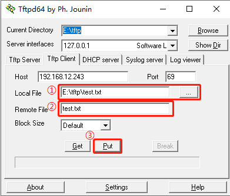

# TFTP：简单文件传输协议

## 1、介绍

[TFTP](https://baike.baidu.com/item/TFTP) （Trivial File Transfer Protocol, 简单文件传输协议）是 TCP/IP 协议族中的一个用来在客户机与服务器之间进行简单文件传输的协议，提供不复杂、开销不大的文件传输服务，端口号为 **69** ，比传统的 FTP 协议要轻量级很多，适用于小型的嵌入式产品上。

RT-Thread 目前支持 TFTP 服务器和 TFTP 客户端。

## 2 TFTP 服务器

下面将介绍设备端启动 TFTP 服务器，PC 端作为客户端从设备上读写文件的流程。

### 2.1 启动 TFTP 服务器

在传输文件前，需要在 MSH 终端上使用 `tftp -s` 命令来启动 TFTP 服务器，大致效果如下：

```shell
msh />tftp -s
msh />tftp server start!
```

### 2.2 客户端配置

PC 端打开 `Tftpd64` 软件，按如下操作进行客户端的配置：

- 1、选择 `Tftp Client` ；
- 2、填写 TFTP 服务器的 IP 地址。可以在 RT-Thread 的 MSH 下使用 `ifconfig` 命令查看；
- 3、填写 TFTP 服务器端口号，默认： `69` 


#### 2.2.1 发送文件到设备端

- 1、Local File 是 PC 端发送到设备端的文件路径；
- 2、`Remote File` 是服务器端保存文件的路径（包括文件名），服务端支持相对路径和绝对路径。由于 RT-Thread 默认开启 `DFS_USING_WORKDIR` 选项，此时相对路径是基于 Finsh/MSH 当前进入的目录。所以，使用相对路径时，务必提前切换好目录；
- 3、点击 `Put` 按钮即可发送文件到设备端。

如下图所示，将文件发送至当前目录下，这里使用的是 **相对路径** ：



> 注意：如果 `DFS_USING_WORKDIR` 未开启，同时 `Remote File` 为空，文件会将保存至根路径下。

#### 2.2.2 从设备端接收文件

- 1、Local File 是 PC 端接收文件的存放路径（包含文件名）；
- 2、`Remote File` 是服务器发送文件的路径（包括文件名），选项支持相对路径和绝对路径。由于 RT-Thread 默认开启 `DFS_USING_WORKDIR` 选项，此时相对路径是基于 Finsh/MSH 当前进入的目录。所以，使用相对路径时，务必提前切换好目录；
- 3、点击 `Get` 按钮即可。

如下所示，将 `/web_root/image.jpg` 保存到本地，这里使用的是 **绝对路径** ：

```
msh /web_root>ls           ##查看文件是否存在
Directory /web_root:
image.jpg           10559                    
msh /web_root>
```


## 2.3 TFTP 客户端

下面将介绍设备端作为 TFTP 客户端，从 PC 上读写文件的流程。

### 2.3.1 服务端配置

打开刚安装的 `Tftpd64` 软件，按如下操作进行配置：

- 1、选择 `Tftp Server` ；
- 2、配置服务器文件夹路径
- 3、在 `Server interfaces` 下拉框中，务必选择好与 RT-Thread 处于同一网段的网卡；


### 2.3.1 TFTP 命令详解

TFTP 客户端读取文件命令详解

tftp -r/-w ip_addr file_name [-p]

- tftp      : 第一个参数固定 `tftp`
- -w        : 往服务器写文件
- -r        : 从服务器读文件
- ip_addr   : 服务器 IP 地址
- file_name : 文件名字
- -p        : 服务器端口号

### 2.3.2 TFTP 读文件

tftp -r ip_addr file_name

使用上述命令将 tftp 服务器上的一个文件下载到本地。命令示例如下:

eg: tftp -r 192.168.1.13 text.txt

从 192.168.1.13 这个服务器上下载 text.txt 文件到本地根路径下

### 2.3.2 TFTP 写文件

tftp -w ip_addr file_name

使用上述命令将本地的一个文件上传到 tftp 服务器。命令示例如下:

eg: tftp -w 192.168.1.13 text.txt

把本地根路径下 text.txt 文件上传到 192.168.1.13 服务器上
